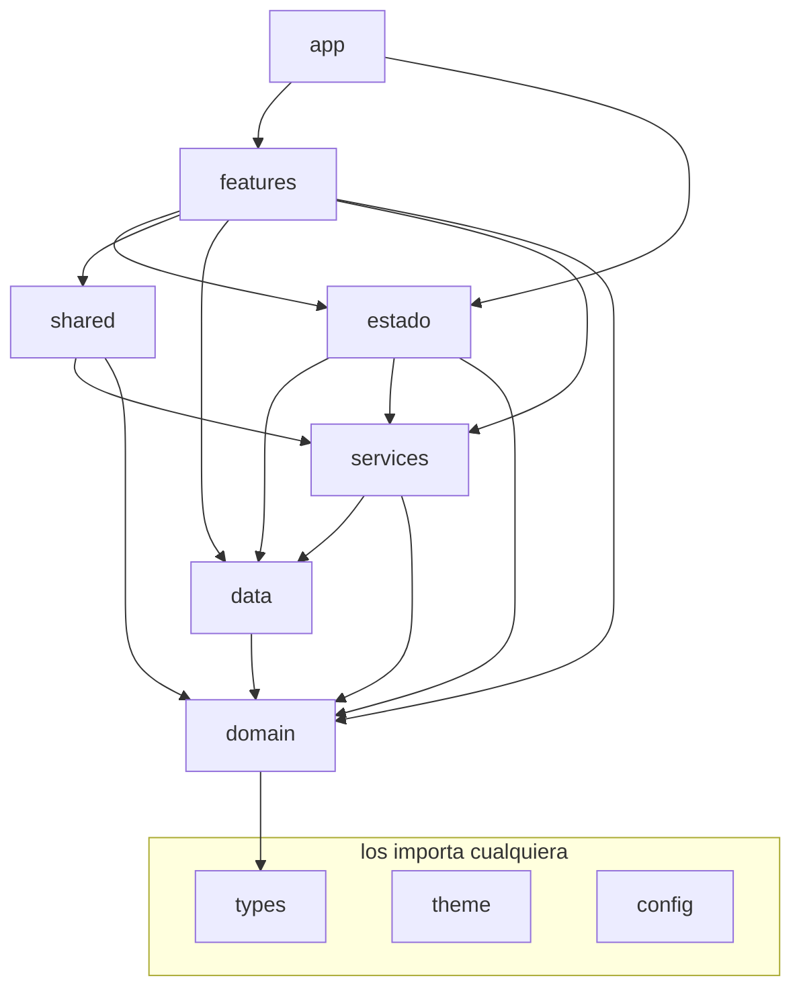

# Arquitectura

## El árbol

```
src/
  app/           arranque (App.tsx, BootScreen) y navegadores (RootNavigator, TabNavigator)
  features/      una carpeta por área de la app
    <feature>/
      screens/     pantallas: solo pintan (≤ 250 líneas)
      components/  piezas de esa feature (una por archivo si pasa de 80 líneas)
      hooks/       lo que la pantalla hace: estado, efectos, carga y acciones
      logic/       reglas puras de esa feature (p. ej. la máquina de estados de un juego)
    juegos/        dulces, caida, colmena, cazala, pares, niveles, fin y comun
  estado/        estado global (Zustand): cuenta, ajustes, desbloqueos y sus hooks
  domain/        reglas puras compartidas: SM-2, cola, match3, colmena, diff, texto, fechas…
  data/          SQLite (cliente, esquema, repos/), AsyncStorage (local/) y el catálogo JSON (contenido.ts)
  services/      lo que habla con el teléfono o con afuera: audio, voz, música, descargas,
                 anuncios, notificaciones, háptica, media, cuenta
  shared/
    ui/            componentes reutilizables (Button, Card, Screen, Presionable, fx/, esqueleto/…)
    hooks/         hooks reutilizables (useCarga, useVisibilidad, useMovimientoReducido…)
    navegacion/    navigationRef
    utils/         medición
  theme/         tokens: paleta, espacios, tipografía, movimiento, fuentes, portadas
  config/        interruptores y constantes (anuncios, aprendizaje, legal, notificaciones…)
  types/         tipos compartidos (catálogo, contenido, rutas, cuenta, legal…)
  assets/        bundled.ts, el mapa de medios generado (fuera de Git)
```

Cada carpeta de primer nivel tiene su `README.md` con lo que vive ahí y lo que puede importar.

---

## Las reglas de capas



| Capa | Puede importar |
|---|---|
| `app` | todo (y es la única capa que nadie importa) |
| `features` | estado, shared, data, services, domain, theme, config, types |
| `estado` | data, services, domain, theme, config, types |
| `shared` | services (sin estado de pantalla), domain, theme, config, types |
| `services` | data, domain, theme, config, types, assets (solo `media` toca `bundled`) |
| `data` | domain, config, types |
| `domain` | types (y nada de React, React Native, Expo ni paquetes) |
| `theme`, `config` | types |
| `types` | nada |

Además:

- **Una feature no importa archivos internos de otra.** Lo que usan dos features sube a `shared/` (si pinta o es
  hook) o a `domain/` (si es regla pura).
- **Cero ciclos** (contando imports de valor).
- **Las pantallas y componentes no escriben SQL ni llaman a AsyncStorage ni a `loadContent`:** todo pasa por el
  hook de su feature (o por `estado/`), que llama a `data/repos`.
- **Los íconos entran solo por `shared/ui/Icon.tsx`.**
- **El mapa generado `assets/bundled.ts` solo lo importa `services/media`**, que reexporta `isBundled` y
  `BUNDLED_COUNT`.
- **Juegos con máquina de estados:** cada partida tiene su reducer con fases con nombre en `logic/`.
- **Barrels (`index.ts`) solo en `shared/ui`, `theme` y `types`.** `theme` y `types` son excepciones documentadas:
  son hojas (no importan capas de arriba) y juntan tokens y tipos que se importan por grupo.
- **Aliases siempre:** `@/…` para `src`, `@data/…` para `assets/data`, `@assets/…` para la carpeta `assets` de la
  raíz (sfx, música, fuentes) y `@modules/…` para los módulos nativos. Nada de `../../`; dentro de una misma carpeta
  vale `./`.
- **Presionable/Pressable** para todo lo que se toca; nada de `TouchableOpacity`.
- **Tamaños:** pantalla ≤ 250 líneas, cualquier archivo ≤ 400. Excepción: `features/cuenta/legal/textos.ts`,
  generado por `scripts/legal.mjs` desde `docs/legal/`.

Quién lo revisa:

| Qué | Comando |
|---|---|
| capas, features, domain puro, ciclos, íconos, imports que resuelven | `npm run check:imports` (sin dependencias) |
| lo mismo con dependency-cruiser | `npm run check:capas` |
| hooks (rules-of-hooks, exhaustive-deps), imports sin uso, `console` fuera de `__DEV__`, React Compiler, `Touchable*` | `npm run lint` |
| colores, duraciones y curvas fuera de `theme` | `npm run check:color`, `npm run audit:diseno` |
| tipos estrictos | `npm run typecheck` |

---

## Cómo agregar…

### …una pantalla

1. Ponle nombre a la ruta y sus parámetros en `types/rutas.ts`.
2. Crea `features/<feature>/screens/<Nombre>Screen.tsx`: solo JSX y estilos.
3. Lo que hace (estado, carga, efectos, acciones) va en `features/<feature>/hooks/use<Nombre>.ts`; la pantalla
   desestructura lo que pinta. Si lee datos, el hook llama a `data/repos/*` (o a `useCarga` con una función del
   repo); si toca audio, a `services/audio`.
4. Regístrala en `app/navegacion/RootNavigator.tsx` (o en `TabNavigator.tsx` si es pestaña).
5. Si una pieza pasa de 80 líneas, va a `components/` en su propio archivo.
6. `npm run typecheck && npm run check:imports && npm run lint`.

### …un juego

1. `features/juegos/<juego>/` con `screens/`, `components/`, `hooks/` y `logic/`.
2. La regla del juego (tablero, jueces, puntaje) va pura en `domain/<juego>.ts` y se prueba con un
   `scripts/check-<juego>.mjs` (Node, sin emulador).
3. La partida es una **máquina de estados explícita**: un reducer en `logic/` con fases con nombre
   (p. ej. Dulces: `jugando → animando → pregunta → respondiendo`; Caída: `cayendo → pausa → perdida`) y el hook
   `usePartida<Juego>` que lo conecta con temporizadores, audio y SM-2.
4. Para que jugar califique en SM-2, el hook registra la partida por `data/repos/partidas.ts` y
   `data/repos/juegos.ts`; los niveles y estrellas salen de `juegos/comun/useNivel.ts`.
5. Ruta en `types/rutas.ts` y en `RootNavigator`; tarjeta en la lista de juegos de Practicar.

### …un servicio

1. `services/<nombre>.ts` con una API chica y documentada (si crece, una carpeta `services/<nombre>/` y una
   fachada `services/<nombre>.ts`, como `audio`).
2. No escribe SQL (usa `data/repos`) ni sabe de pantallas ni de stores.
3. Si el módulo nativo puede faltar (Expo Go, web), cárgalo perezoso y responde «no disponible» en vez de
   romper (como `services/voz.ts`).
4. Las pantallas lo usan a través del hook de su feature o de un hook de `shared/hooks`.

---

## Dónde vive cada cosa

| Busco… | Está en |
|---|---|
| SM-2 y la calificación | `domain/sm2.ts` (`review`, `gradeFrom`) |
| la sesión de estudio | `domain/session.ts` + `features/estudio/hooks/useSessionStore.ts` |
| la cola del día y el filtro de contenido | `data/repos/cola.ts` (`buildFilter`), `domain/cola.ts` |
| el estado SM-2 de una tarjeta | `data/repos/tarjetas.ts` |
| migraciones | `data/esquema.ts` |
| sembrar el catálogo | `data/semilla/sembrar.ts`, desde `assets/data/catalogo.db` (`npm run build:derivados`) |
| leer los JSON de contenido | `data/contenido.ts` (`loadContent`, perezoso por archivo); lo que se necesita al abrir, en `data/resumenContenido.ts` (generado) |
| varias consultas en una | `data/repos/lote.ts` (`Parte`, `correrLote`; p. ej. `resumenPracticar.ts`) |
| el reproductor y los efectos | `services/audio.ts` → `services/audio/*` |
| notificaciones | `services/notificaciones.ts`, horarios en `domain/horarioNotificaciones.ts` |
| cuenta, borrado y consentimientos | `services/cuenta/*`, `estado/useAuthStore.ts` |
| colores, espacios, movimiento | `theme/` |
| animaciones reutilizables | `shared/ui/fx/` |
| la hoja inferior (veredicto, pausa, pregunta) | `shared/ui/Hoja.tsx` |
| recomprimir audio e imágenes | `scripts/optimiza-audio.mjs`, `scripts/optimiza-imagenes.mjs` (originales en `medios-originales/`) |
| lo que corre después de que Practicar es interactivo | `services/trasArranque.ts` (`trasArranque`, `listoParaDiferidos`) |
| la «última versión» de algo sin ref en el render | `shared/hooks/useUltimo.ts` (estado ajustado en el render) |
| try/finally dentro de hooks (el React Compiler no compila `finally`) | `shared/utils/conFinal.ts` |
| marcas del arranque (medición) | `shared/utils/marcasArranque.ts`, `scripts/medir-arranque.sh` |

---

## Flujo de una sesión de estudio

```
  HomeScreen (features/practicar)
     │  nav.navigate('Study')
     ▼
  StudyScreen → useSesionEstudio               features/estudio
     │  useSessionStore.start(userId, filter, meta, nuevas)
     ▼
  useSessionStore
     │  getDueCards()    ─▶ data/repos/tarjetas
     │  getNewCards()    ─▶ data/repos/tarjetas
     │  getDistractors() ─▶ data/repos/distractores   (todos de golpe, no uno por tarjeta)
     ▼
  new StudySession(...)          domain/session.ts
     │  intercala vencidas y nuevas cada 4
     │  buildCard() elige el ejercicio según repeticiones
     ▼
  StudyCardView                  pinta según kind
     │  el usuario responde
     ▼
  gradeFrom(correct, elapsedMs, usedHint)   →  1, 2, 3 o 4
     │
     ▼
  review(state, grade)           domain/sm2.ts
     │  devuelve estado nuevo; StudySession.answer() dice si la
     │  sesión de verdad la reinserta (`reinsertada`, solo la fallada)
     ▼
  upsertCardState()  ─▶ data/repos/tarjetas
     │
     ▼
  HojaVeredicto sube desde abajo (features/estudio/components)
     │  "Siguiente"
     ▼
  session.current()  →  siguiente tarjeta, o fin
     │  al fin: finish() guarda la racha, cierra la sesión
     │  y programa la próxima notificación
```

---

## SM-2, en concreto

| Repetición | Qué pasa |
|---|---|
| 0 → 1 (acierto) | vuelve en 1 minuto |
| 1 → 2 (acierto) | vuelve en 10 minutos |
| 2 → 3 (acierto) | gradúa: 1 día, o 3 si fue "fácil" |
| 3+ (acierto) | intervalo × facilidad, tope 180 días |
| cualquiera (fallo) | intervalo a 0, vuelve en 1 minuto, facilidad −0.2 |

La facilidad arranca en 2.5 y se mueve entre 1.3 y 2.8.
Dominada = 4 repeticiones y 21 días de intervalo.

El `vence_en` cae en **medianoche** del día objetivo, no a la hora
exacta, para que "las de hoy" signifique lo mismo a las 7 am y a las
11 pm.

---

## Cómo se elige el ejercicio

```
  repeticiones = 0        →  reconocer
  fallos ≥ 3 y va perdiendo →  reconocer   (bajar la exigencia)
  repeticiones = 1        →  escuchar, o reconocer si no hay audio
  repeticiones = 2        →  completar, o reconocer si no aplica
  repeticiones ≥ 3        →  alterna, con más peso a escribir
```

La progresión importa: si la primera vez que ves una frase te piden
escribirla, te rindes. Y si a la décima te siguen dando cuatro opciones,
no aprendes a producirla.

---

## Esquema de la base

```
entrada          el catálogo, sembrado desde JSON
usuario          cuentas locales
tarjeta          estado SM-2 por usuario y entrada
progreso         racha y totales
ajuste           preferencias por usuario
pack_estado      qué packs están descargados
sesion           historial, alimenta la gráfica de P-13
notif_log        qué notificaciones ya se mandaron
extra_visto      progreso de errores, fonemas y demás
```

Los índices están puestos sobre las consultas del camino caliente. El
más importante es `ix_tarjeta_cola (usuario_id, vence_en)`: sin él, la
consulta de la cola escanea las 1,524 filas en cada arranque.

Las migraciones van en `data/esquema.ts` numeradas. **Nunca edites una ya
publicada**, agrega una nueva al final.

---

## Filtro de contenido

Todas las consultas de contenido pasan por `buildFilter()` (`data/repos/cola.ts`):

```ts
{ modoLimpio: boolean, niveles: Nivel[], packs?: string[], mundos?: string[] }
```

Aplica siempre `is_canonical = 1` y `revisar = 0`, y agrega
`vulgaridad = 0` si el Modo Limpio está encendido.

Si este filtro se replica por pantalla, tarde o temprano una se olvida y
sale una frase de vulgaridad 2 con el Modo Limpio activo. Por eso está
en un solo lugar.

---

## Qué hace cada servicio

**audio** (`services/audio.ts`, fachada de `services/audio/*`) — un solo player reutilizado. Resuelve rutas
relativas (`aud/18.mp3`) contra lo descargado primero y lo empaquetado después, con caché de existencia para no
hacer un stat por toque. Los efectos (`efectos.ts`, `paquetesSfx.ts`) y el estado del reproductor viven aparte.

**notificaciones** (`services/notificaciones.ts`) — aplica las cinco prohibiciones del JSON en código: dentro de
la ventana horaria, nunca vulgaridad 2, nunca mencionar la racha rota, silencio total tras 14 días sin abrir, y
el tope diario (`config/notificaciones.ts`). Una plantilla con un token que no existe **se descarta** y la
notificación cae en otra, así nadie ve `{racha}` literal (en desarrollo truena para arreglar el JSON). El reparto de horas es puro: `domain/horarioNotificaciones.ts`.

**cuenta** (`services/cuenta/auth.ts`) — Google por el módulo nativo `@modules/wero-google-auth`; las cuentas
locales que ya existen usan SHA-256 con sal por usuario. Protege de que alguien abra la base y lea contraseñas en
claro, y nada más. `borrado.ts` y `consentimiento.ts` cubren borrar la cuenta y los permisos.

**descargas** (`services/descargas.ts`) — archivo por archivo con el manifest como guía, no un zip. Un zip de
8 MB que se corta al 90% se pierde entero; archivo por archivo se reanuda donde iba comparando tamaños.

**voz** (`services/voz.ts`) — el reconocedor, con carga perezosa para que la app siga corriendo donde el módulo
nativo no existe.

---

## Historia

Las decisiones de la v3 (migración 2 de la base, los ejercicios nuevos, el arcade, los juegos, el micrófono y las
notificaciones repartidas) están en `docs/V3.md`. La reorganización a `features/` y capas se planeó en
`docs/PLAN-ESTRUCTURA.md`.

