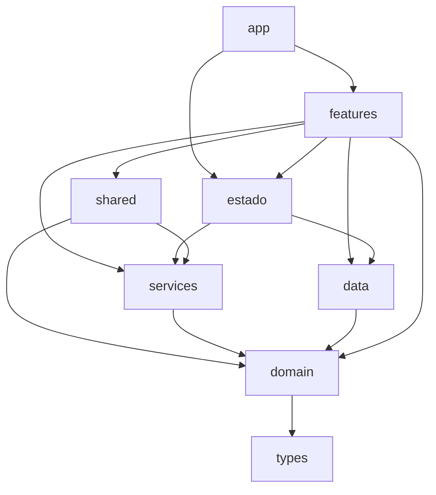

# Plan de estructura (prompt 2 de 6) — hecho

La propuesta de abajo se aprobó («ok a todo») y ya está aplicada en `perf/serie-rendimiento`. El árbol y las reglas
vigentes están en `docs/ARQUITECTURA.md`; esta sección es el resultado.

## Resultado

| Regla | Estado | Quién la revisa |
|---|---|---|
| Capas (app → features → estado → shared/services → data → domain; theme, config y types abajo) | 0 violaciones | `check:imports`, `check:capas` |
| Una feature no importa internos de otra | 0 | `check:imports`, `check:capas` |
| domain puro (sin React, RN, Expo ni paquetes) | 0 | `check:imports`, `check:capas` |
| Ciclos | 0 | `check:imports`, `check:capas` |
| Pantallas ≤ 250 líneas, archivos ≤ 400 | sí, salvo `features/cuenta/legal/textos.ts` (1,066, lo genera `scripts/legal.mjs`) | a mano (`wc -l`) |
| Pantallas y componentes sin SQL, AsyncStorage ni `loadContent` | 0 | `grep` sobre `screens/` y `components/` |
| Juegos con máquina de estados | Dulces, Caída, Colmena, Cázala (reducers) y Pares (`fasePares`) | `check:dulces`, `check:caida`… |
| Un componente de más de 80 líneas por archivo | sí (los de al lado son piezas chicas de ≤ 80) | a mano |
| Solo `Presionable`/`Pressable` | 0 `Touchable*` | `audit:diseno` (MOT-2) |
| Barrels solo en `shared/ui` (+ `theme` y `types`, hojas documentadas) | sí | a mano |
| Aliases, sin `../../` | 0 (alias nuevo `@assets/`) | `grep` |
| TypeScript estricto | sí | `typecheck` |
| ESLint (rules-of-hooks y exhaustive-deps como error, imports sin uso, console fuera de `__DEV__`) | 0 errores | `lint` |

Tamaño: 368 → 433 archivos `.ts/.tsx` en `src/` (sin `bundled.ts`), 54,487 líneas. El bundle de Hermes subió
49 KB (+0.6 %) por los módulos nuevos (2,425 → 2,484); ver `docs/RENDIMIENTO.md`.

### Archivos grandes: antes y después

| Antes (tag `antes-de-rendimiento`) | Líneas | Ahora (líneas) |
|---|---|---|
| `legal/textos.ts` | 1066 | `features/cuenta/legal/textos.ts` (1066) |
| `services/audio.ts` | 1052 | `services/audio.ts` (294) |
| `screens/games/DulcesScreen.tsx` | 846 | `features/juegos/dulces/screens/DulcesScreen.tsx` (179) |
| `screens/games/CaidaScreen.tsx` | 770 | `features/juegos/caida/screens/CaidaScreen.tsx` (235) |
| `db/queries.ts` | 758 | partido en `data/repos/*` (15 archivos, el mayor `cola.ts` con 309) |
| `screens/games/ColmenaScreen.tsx` | 744 | `features/juegos/colmena/screens/ColmenaScreen.tsx` (233) |
| `screens/games/ParesScreen.tsx` | 593 | `features/juegos/pares/screens/ParesScreen.tsx` (236) |
| `screens/utility/SettingsScreen.tsx` | 540 | `features/ajustes/screens/SettingsScreen.tsx` (181) |
| `theme/tokens.ts` | 524 | `theme/tokens.ts` (284) |
| `screens/entry/OnboardingScreen.tsx` | 498 | `features/cuenta/screens/OnboardingScreen.tsx` (176) |
| `services/notifications.ts` | 493 | `services/notificaciones.ts` (330) |
| `screens/study/StudyScreen.tsx` | 484 | `features/estudio/screens/StudyScreen.tsx` (228) |
| `screens/extras/LecturaScreen.tsx` | 472 | `features/lecturas/screens/LecturaScreen.tsx` (180) |
| `components/juegos/dulces/TableroDulces.tsx` | 455 | `features/juegos/dulces/components/TableroDulces.tsx` (397) |
| `store/useSessionStore.ts` | 443 | `features/estudio/hooks/useSessionStore.ts` (386) |
| `screens/games/NivelesScreen.tsx` | 434 | `features/juegos/niveles/screens/NivelesScreen.tsx` (183) |
| `types/content.ts` | 427 | `types/content.ts` (211) |
| `components/card/StudyCardView.tsx` | 422 | `features/estudio/components/StudyCardView.tsx` (381) |
| `components/juegos/colmena/Hexagono.tsx` | 412 | `features/juegos/colmena/components/Hexagono.tsx` (352) |
| `screens/extras/EarModeScreen.tsx` | 403 | `features/oido/screens/EarModeScreen.tsx` (223) |
| `services/speech.ts` | 400 | `services/voz.ts` (400) |
| `components/mazo/MazoCartas.tsx` | 393 | `features/frases-sueltas/components/MazoCartas.tsx` (260) |
| `theme/motion.ts` | 381 | `theme/motion.ts` (381) |
| `screens/extras/MinimalPairsScreen.tsx` | 375 | `features/sonidos/screens/MinimalPairsScreen.tsx` (240) |
| `db/schema.ts` | 373 | `data/esquema.ts` (373) |
| `screens/extras/GramaticaTemaScreen.tsx` | 370 | `features/gramatica/screens/GramaticaTemaScreen.tsx` (205) |
| `components/errores/SecuenciaMalentendido.tsx` | 367 | `features/errores/components/SecuenciaMalentendido.tsx` (368) |
| `components/juegos/pares/CableSenal.tsx` | 353 | `features/juegos/pares/components/CableSenal.tsx` (353) |
| `screens/extras/PronunciationScreen.tsx` | 340 | `features/sonidos/screens/PronunciationScreen.tsx` (158) |
| `screens/extras/practicar/ConsolaHoy.tsx` | 339 | `features/practicar/components/ConsolaHoy.tsx` (328) |
| `components/juegos/colmena/RanurasPalabra.tsx` | 338 | `features/juegos/colmena/components/RanurasPalabra.tsx` (338) |
| `screens/extras/AzarScreen.tsx` | 334 | `features/frases-sueltas/screens/AzarScreen.tsx` (127) |
| `domain/session.ts` | 322 | `domain/session.ts` (322) |
| `components/card/TileBuilder.tsx` | 321 | `features/estudio/components/TileBuilder.tsx` (321) |
| `services/auth.ts` | 319 | `services/cuenta/auth.ts` (224) |
| `db/cola.ts` | 316 | `data/repos/cola.ts` (309), `domain/cola.ts` (127) |
| `domain/marcas.ts` | 305 | `domain/marcas.ts` (305) |
| `screens/games/CazalaScreen.tsx` | 304 | `features/juegos/cazala/screens/CazalaScreen.tsx` (146) |
| `components/gramatica/CorreccionFrase.tsx` | 296 | `shared/ui/CorreccionFrase.tsx` (296) |
| `screens/entry/AuthScreen.tsx` | 295 | `features/cuenta/screens/AuthScreen.tsx` (242) |
| `screens/extras/PracticeScreen.tsx` | 294 | `features/practicar/screens/PracticeScreen.tsx` (188) |
| `components/fx/Espectrograma.tsx` | 289 | `features/progreso/components/Espectrograma.tsx` (25) |
| `domain/distractores.ts` | 281 | `domain/distractores.ts` (281) |
| `screens/discover/DetailScreen.tsx` | 277 | `features/detalle/screens/DetailScreen.tsx` (200) |
| `services/music.ts` | 272 | `services/musica.ts` (272) |
| `components/fx/PortadaJuego.tsx` | 266 | `features/practicar/components/PortadaJuego.tsx` (266) |
| `components/sonidos/PaginaFonema.tsx` | 264 | `features/sonidos/components/PaginaFonema.tsx` (266) |
| `components/base/Screen.tsx` | 264 | `shared/ui/Screen.tsx` (264) |
| `components/fx/HojaVeredicto.tsx` | 261 | `features/estudio/components/HojaVeredicto.tsx` (263) |
| `screens/utility/ProgressScreen.tsx` | 259 | `features/progreso/screens/ProgressScreen.tsx` (185) |
| `screens/games/GameEndScreen.tsx` | 259 | `features/juegos/fin/screens/GameEndScreen.tsx` (192) |
| `store/useAuthStore.ts` | 256 | `estado/useAuthStore.ts` (256) |
| `navigation/TabNavigator.tsx` | 252 | `app/navegacion/TabNavigator.tsx` (252) |
| `components/legal/HojaConsentimiento.tsx` | 252 | `shared/ui/HojaConsentimiento.tsx` (252) |
| `components/juegos/pares/TarjetaFusion.tsx` | 252 | `features/juegos/pares/components/TarjetaFusion.tsx` (254) |
| `domain/match3.ts` | 251 | `domain/match3.ts` (251) |

Los que siguen arriba de 250 no son pantallas y están bajo 400: lógica pura (`domain/session.ts`, `match3.ts`,
`marcas.ts`, `distractores.ts`), tokens (`theme/motion.ts`), el esquema de la base y componentes de una sola pieza
animada (tablero, panal, cable).

### Avisos del React Compiler (para el prompt 4)

`npm run lint` los muestra como warning (`react-compiler/react-compiler`); son 60 y ninguno cambia lo que hace la app
hoy: dicen dónde el compilador no podría optimizar.

**39 · Se salta el componente o hook porque tiene un `eslint-disable` de las reglas de hooks**

`estado/useMusicaPantalla.ts:41`, `features/estudio/components/HojaVeredicto.tsx:99`, `features/estudio/components/PalabraVoladora.tsx:45`, `features/estudio/components/StudyCardView.tsx:122`, `features/estudio/components/StudyCardView.tsx:154`, `features/estudio/hooks/useSesionEstudio.ts:157`, `features/estudio/hooks/useSesionEstudio.ts:240`, `features/frases-sueltas/components/CartaEnMazo.tsx:77`, `features/frases-sueltas/hooks/useFrasesSueltas.ts:107`, `features/frases-sueltas/hooks/useFrasesSueltas.ts:154`, `features/frases-sueltas/hooks/useFrasesSueltas.ts:159`, `features/juegos/cazala/components/ResultadoCaza.tsx:88`, `features/juegos/colmena/components/Hexagono.tsx:134`, `features/juegos/colmena/components/Hexagono.tsx:178`, `features/juegos/colmena/components/Hexagono.tsx:203`, `features/juegos/colmena/hooks/useRondaColmena.ts:141`, `features/juegos/dulces/components/ChipCascada.tsx:49`, `features/juegos/dulces/components/FraseVoladora.tsx:48`, `features/juegos/dulces/components/MetaFrase.tsx:98`, `features/juegos/dulces/components/Pieza.tsx:132`, `features/juegos/dulces/components/Pieza.tsx:170`, `features/juegos/dulces/components/TableroDulces.tsx:93`, `features/juegos/dulces/hooks/usePartidaDulces.ts:356`, `features/juegos/fin/hooks/useFinJuego.ts:55`, `features/juegos/fin/hooks/useFinJuego.ts:75`, `features/juegos/pares/components/CableSenal.tsx:256`, `features/juegos/pares/components/CableSenal.tsx:264`, `features/juegos/pares/components/FichaPar.tsx:55`, `features/juegos/pares/components/TarjetaFusion.tsx:162`, `features/oido/hooks/useModoOido.ts:131`, `features/practicar/components/ConsolaHoy.tsx:171`, `features/sonidos/hooks/usePronunciacion.ts:67`, `features/sonidos/hooks/usePronunciacion.ts:117`, `features/sonidos/hooks/usePronunciacion.ts:125`, `shared/hooks/useCarga.ts:154`, `shared/hooks/useCarga.ts:164`, `shared/hooks/useCortarAudioAlSalir.ts:26`, `shared/ui/MarcoImagen.tsx:91`, `shared/ui/RoundTimer.tsx:75`

**14 · `useCarga` (y `useCallback`/`useMemo`) reciben una función que no está escrita en línea**

`features/ajustes/hooks/useDescargas.ts:19`, `features/errores/hooks/useDetalleError.ts:20`, `features/errores/hooks/useErrores.ts:26`, `features/juegos/comun/useNivel.ts:17`, `features/juegos/niveles/hooks/useNivelesJuego.tsx:48`, `features/lecturas/hooks/useLectura.ts:56`, `features/lecturas/hooks/useLecturas.ts:24`, `features/phrasal/hooks/usePhrasal.ts:25`, `features/phrasal/hooks/usePhrasalVerbo.ts:45`, `features/sonidos/hooks/useContracciones.ts:18`, `features/sonidos/hooks/useParesMinimos.ts:33`, `features/vocabulario/hooks/useDetalleMundo.ts:24`, `features/vocabulario/hooks/useDetallePack.ts:22`, `features/vocabulario/hooks/useExplorar.ts:25`

**3 · Muta un valor que devolvió un hook (p. ej. `.value` o `.current` de algo que no es ref ni shared value propio)**

`features/ajustes/screens/DownloadsScreen.tsx:53`, `features/juegos/colmena/screens/ColmenaScreen.tsx:146`, `features/lecturas/screens/LecturaScreen.tsx:94`

**3 · Muta una variable que React considera inmutable (props, estado o algo capturado en render)**

`features/juegos/caida/hooks/usePartidaCaida.ts:232`, `features/lecturas/hooks/useReproductorCapitulo.ts:73`, `shared/ui/CorreccionFrase.tsx:215`

**1 · Muta props o argumentos de un hook**

`shared/ui/Screen.tsx:58`

---

## 1. Diagnóstico del árbol actual

370 archivos, 53,410 líneas en `src/`. Marcas: `>300` archivo largo · `DB:` pantalla o componente que llama a
`src/db` directo · `ASYNC` AsyncStorage directo · `AUDIO` pantalla que llama al servicio de audio o voz directo ·
`BASE→` componente base que importa algo de afuera de la capa base.

- **Dependencias circulares:** 0 (madge 8, contando también los `import type`).
- **TypeScript estricto:** ya está (`strict`, `noUncheckedIndexedAccess`, `noImplicitOverride`).
- **TouchableOpacity/Highlight:** 0 (todo usa `Presionable`/`Pressable`).
- **`Platform.OS`:** 13 usos en 8 archivos, todos diferencias chicas → se quedan (`Platform.select` donde aplique); no
  hace falta ningún `.android.tsx`.
- **`../../`:** 2 imports (`modules/wero-google-auth`, módulo nativo fuera de `src/`) → alias `@modules/`.
- **Dependencias al revés detectadas:**
  - `domain/cola.ts` importa un tipo de `db/cola.ts` (`ContentFilter`).
  - `components/fx/Espectrograma.tsx` importa `components/progreso/datos.ts`, que a su vez importa
    `screens/extras/practicar/resumenNiveles.ts` (componente → pantalla).
  - `components/base/{Ads,Button,Card,IconButton}` importan servicios (anuncios, háptica, media).
  - `components/unlock/MuroDesbloqueo` lee el store directo.
  - `hooks/useMusicaPantalla` lee el store de ajustes; `hooks/useBarraOculta` importa la navegación.
  - `db/*` importa `utils/date` y `config/aprendizaje`; `domain/*` importa `utils/text|array|date`.
- **Barrels sin uso:** 10 `index.ts` (db, domain, services, store, screens/*) que nadie importa.

```
assets/
  bundled.ts 31
components/atoradas/
  Desatorar.tsx 150
  MedidorAtasco.tsx 73
  TarjetaAtorada.tsx 86
components/base/
  Ads.tsx 209  ⚠ BASE→@/services/ads
  Badge.tsx 111
  Button.tsx 190  ⚠ BASE→@/services/haptics
  Card.tsx 217  ⚠ BASE→@/services/media
  Carga.tsx 50
  EmptyState.tsx 57
  EncabezadoComprimido.tsx 97
  ErrorBoundary.tsx 86
  Header.tsx 81
  Icon.tsx 179
  IconButton.tsx 95  ⚠ BASE→@/services/haptics
  Input.tsx 102
  NotaInfo.tsx 38
  Presionable.tsx 85
  ProgressBar.tsx 67
  RoundTimer.tsx 121
  Screen.tsx 265
  Skeleton.tsx 52
  index.ts 25
components/card/
  AudioButton.tsx 113
  BloqueVoz.tsx 97
  DiffFrase.tsx 59
  FilaEstrellas.tsx 35
  FraseHueco.tsx 102
  GrupoAudio.tsx 80
  MarcoImagen.tsx 171
  OptionButton.tsx 217
  PalabraVoladora.tsx 70
  PhraseBlock.tsx 111
  SceneImage.tsx 77
  StudyCardView.tsx 423  ⚠ >300
  TileBuilder.tsx 322  ⚠ >300
  index.ts 11
  useAudioFrase.ts 62
components/detalle/
  Aparece.tsx 56
  BotonGuardar.tsx 97
  CuandoNoDecirla.tsx 57
  EscalaRegistro.tsx 144
  FilaDondeVive.tsx 59
  HeroeFrase.tsx 91
  NotaPlegable.tsx 92
  index.ts 8
components/entrada/
  BotonGoogle.tsx 92
  index.ts 2
components/errores/
  DueloContraste.tsx 105
  MedidorGravedad.tsx 92
  SecuenciaMalentendido.tsx 368  ⚠ >300
  SenalRota.tsx 141
  TarjetaError.tsx 101
components/esqueleto/
  Hueso.tsx 199
  index.ts 11
components/estudio/
  FinDelDia.tsx 110
components/feedback/
  Confetti.tsx 89
  Trozos.tsx 119
  index.ts 5
  useEfectoResultado.ts 77
  useReaccion.ts 29
components/fx/
  AnilloMeta.tsx 134
  AnilloRadio.tsx 212
  BarraSesion.tsx 180
  BordePunteado.tsx 46
  BotonSenal.tsx 123
  CableTrazo.tsx 104
  ChipMarcador.tsx 57
  Espectrograma.tsx 290
  FondoAurora.tsx 216
  FraseKaraoke.tsx 150
  FxSeguro.tsx 32
  HojaVeredicto.tsx 262
  Marcador.tsx 103
  MedidorSenal.tsx 195
  MedidorVU.tsx 130
  OndaSenal.tsx 73
  OndaVoz.tsx 147
  PildoraLiquida.tsx 95
  PortadaJuego.tsx 267
  PuntosRepeticion.tsx 77
  TarjetaTilt.tsx 68
  TransicionHoy.tsx 112
  estadoTransicion.ts 35
  index.ts 28
  onda.ts 45
  useBolsillo.ts 50
  useDesfaseVentana.ts 25
  useSenalActiva.ts 87
  useVisibilidad.ts 105
  useVozEnVivo.ts 115
  useVozFrase.ts 38
components/gramatica/
  BloqueGramatica.tsx 140
  CorreccionFrase.tsx 297
  EjemploFrase.tsx 97
  ErrorQueSeCorrige.tsx 88
  FormulaFichas.tsx 139
  MedidorNivel.tsx 49
  RenglonTema.tsx 151
components/juegos/caida/
  BarraTiempo.tsx 48
  FichaCaida.tsx 199
  FinCaida.tsx 199
  FraseRonda.tsx 44
  HojaPausa.tsx 171
  IndicadorRitmo.tsx 59
  PisoResplandor.tsx 102
  PistaCaida.tsx 123
  medidas.ts 75
components/juegos/cazala/
  BloqueEscucha.tsx 135
  FraseMorph.tsx 173
  PieCaza.tsx 105
  RenglonCaza.tsx 207
  ResultadoCaza.tsx 167
  Reticulo.tsx 74
  useVozCaza.ts 69
components/juegos/colmena/
  BloqueEscuchar.tsx 69
  FraseResuelta.tsx 77
  Hexagono.tsx 413  ⚠ >300
  Panal.tsx 82
  ProgresoHex.tsx 97
  RanurasPalabra.tsx 339  ⚠ >300
  geometria.ts 237
  useVozRonda.ts 24
components/juegos/dulces/
  ChipCascada.tsx 80
  Estallidos.tsx 128
  FraseVoladora.tsx 87
  HojaPregunta.tsx 221
  MetaFrase.tsx 209
  PieDulces.tsx 124
  Pieza.tsx 242
  SimboloPieza.tsx 75
  TableroDulces.tsx 456  ⚠ >300
  piezas.ts 104
  tablero.ts 120
components/juegos/pares/
  CableSenal.tsx 354  ⚠ >300
  FichaPar.tsx 142
  FichasJugadas.tsx 49
  RelojRonda.tsx 72
  SegmentosPares.tsx 105
  Sello.tsx 59
  TarjetaFusion.tsx 253
  geometria.ts 83
components/lectura/
  AnilloFrases.tsx 84
  CierreLectura.tsx 92
  EsqueletoTexto.tsx 56
  LeyendaFrases.tsx 63
  Oracion.tsx 150
  PieReproductor.tsx 131
  PreguntaUnaAUna.tsx 104
  TarjetaLectura.tsx 161
  TextoAcompanado.tsx 230
  useReproductorCapitulo.ts 195
components/legal/
  BotonMantener.tsx 102
  FilaLegal.tsx 50
  HojaConsentimiento.tsx 253
  TextoLegal.tsx 76
  index.ts 5
components/list/
  EntryRow.tsx 162
  EntryRowHueso.tsx 50
  PuntoMundo.tsx 33
  SectionTitle.tsx 61
  iconoMundo.ts 17
  index.ts 5
components/mazo/
  AvisoDeshacer.tsx 81
  CartaFrase.tsx 171
  DeslizarQuitar.tsx 109
  IndicadorArrastre.tsx 86
  MazoCartas.tsx 394  ⚠ >300
  TarjetaGuardada.tsx 103
components/niveles/
  AnilloActual.tsx 55
  CeldaNivel.tsx 213
  DesbloqueoCelda.tsx 67
  EncabezadoNiveles.tsx 89
  EncabezadoTramo.tsx 119
  EsqueletoNiveles.tsx 68
  EstrellasCelda.tsx 95
  FilaNiveles.tsx 66
  index.ts 11
  useRecompensaNiveles.ts 73
  useScrollNivel.ts 125
components/phrasal/
  ChipsFormas.tsx 75
  DetalleForma.tsx 194
  RenglonVerbo.tsx 115
  RuletaParticulas.tsx 198
  ViajeVerbo.tsx 102
components/progreso/
  BarraFina.tsx 50
  CuadroDato.tsx 81
  Detalle.tsx 90  ⚠ DB:@/db/queries
  FichaJuego.tsx 77
  FilaMundo.tsx 64
  PanelSenal.tsx 150  ⚠ DB:@/db/queries
  datos.ts 204
  index.ts 7
components/sonidos/
  DueloPar.tsx 144
  IndiceFonemas.tsx 128
  MapaBoca.tsx 232
  PaginaFonema.tsx 265
  RenglonPalabra.tsx 98
  ViajeSimbolo.tsx 108
components/unlock/
  CandadoBadge.tsx 36
  MuroDesbloqueo.tsx 159  ⚠ DB:@/db/unlock
  index.ts 3
components/voz/
  MedidorMicrofono.tsx 54
config/
  aprendizaje.ts 16
  consentimientos.ts 50
  legal.ts 29
  monetizacion.ts 21
  pantalla.ts 9
db/
  client.ts 71
  cola.ts 317  ⚠ >300
  economy.ts 203
  games.ts 35
  index.ts 11
  levels.ts 207
  progress.ts 134
  queries.ts 759  ⚠ >300
  rows.ts 99
  schema.ts 374  ⚠ >300
  seed.ts 131
  semilla.ts 38
  settings.ts 153
  unlock.ts 81
domain/
  atoradas.ts 117
  caida.ts 122
  cazala.ts 174
  cola.ts 128
  colmena.ts 106
  diff.ts 69
  distractores.ts 282
  errores.ts 134
  exercise.ts 228
  gramatica.ts 69
  guardadas.ts 55
  index.ts 11
  lectura.ts 193
  marcas.ts 306  ⚠ >300
  match3.ts 252
  match3Pasos.ts 185
  mazo.ts 202
  minimalPairs.ts 217
  niveles.ts 219
  oraciones.ts 171
  pares.ts 69
  phrasal.ts 81
  plantillas.ts 49
  registro.ts 30
  ruleta.ts 79
  seguidas.ts 17
  session.ts 323  ⚠ >300
  sm2.ts 157
  vocales.ts 113
  voz.ts 71
hooks/
  useBarraOculta.ts 44
  useCarga.ts 211
  useCortarAudioAlSalir.ts 30
  useEntradaPantalla.ts 39
  useEscucha.ts 92
  useMusicaPantalla.ts 45
legal/
  textos.ts 1067  ⚠ >300
  tipos.ts 22
navigation/
  RootNavigator.tsx 144
  TabNavigator.tsx 253
  index.ts 6
  navigationRef.ts 23
  routes.ts 92
  theme.ts 18
screens/discover/
  DetailScreen.tsx 278  ⚠ DB:@/db/queries
  ExploreScreen.tsx 197  ⚠ DB:@/db/queries
  PackDetailScreen.tsx 119  ⚠ DB:@/db/queries
  WorldDetailScreen.tsx 132  ⚠ DB:@/db/queries
  index.ts 5
screens/entry/
  AuthScreen.tsx 296
  BootScreen.tsx 121  ⚠ DB:@/db/seed,@/db/client AUDIO
  OnboardingScreen.tsx 499  ⚠ >300 DB:@/db/settings
  index.ts 4
screens/extras/
  AzarScreen.tsx 335  ⚠ >300 DB:@/db/queries AUDIO
  ContractionsScreen.tsx 198  ⚠ DB:@/db/queries
  EarModeScreen.tsx 404  ⚠ >300 DB:@/db/queries AUDIO
  ErrorDetailScreen.tsx 118
  ErrorsScreen.tsx 249
  GramaticaScreen.tsx 147
  GramaticaTemaScreen.tsx 371  ⚠ >300 AUDIO
  LecturaScreen.tsx 473  ⚠ >300 DB:@/db/queries AUDIO
  LecturasScreen.tsx 149  ⚠ DB:@/db/queries
  MinimalPairsScreen.tsx 376  ⚠ >300 DB:@/db/economy AUDIO
  PhrasalScreen.tsx 155
  PhrasalVerboScreen.tsx 192
  PracticeScreen.tsx 302  ⚠ >300 DB:@/db/economy,@/db/levels,@/db/progress,@/db/queries
  PronunciationScreen.tsx 341  ⚠ >300 AUDIO
  index.ts 15
screens/extras/practicar/
  ConsolaHoy.tsx 340  ⚠ >300
  Destacados.tsx 180
  EncabezadoPracticar.tsx 57
  FilaModo.tsx 151
  GrupoPlegable.tsx 117
  MetaModo.tsx 81
  RetoSemana.tsx 104
  celebracion.ts 23  ⚠ ASYNC
  consola.ts 32
  entrada.ts 11
  hoy.ts 70
  iconos.ts 32
  metadatos.ts 66
  modos.ts 169
  resumenNiveles.ts 29
  reto.ts 24
screens/games/
  CaidaScreen.tsx 771  ⚠ >300 DB:@/db/games,@/db/levels,@/db/queries AUDIO
  CazalaScreen.tsx 305  ⚠ >300 DB:@/db/games AUDIO
  ColmenaScreen.tsx 745  ⚠ >300 DB:@/db/games,@/db/queries AUDIO
  DulcesScreen.tsx 847  ⚠ >300 DB:@/db/games,@/db/queries AUDIO
  GameEndScreen.tsx 260  ⚠ DB:@/db/economy,@/db/levels AUDIO
  NivelesScreen.tsx 435  ⚠ >300 DB:@/db/levels
  ParesScreen.tsx 594  ⚠ >300 DB:@/db/games,@/db/queries AUDIO
  index.ts 8
  useNivel.ts 66  ⚠ DB:@/db/levels
screens/
  index.ts 7
screens/study/
  StudyScreen.tsx 485  ⚠ >300
  index.ts 2
screens/utility/
  BorrarScreen.tsx 176
  DeckScreen.tsx 228  ⚠ DB:@/db/queries
  DiagnosticsScreen.tsx 113  ⚠ DB:@/db/seed,@/db/queries
  DownloadsScreen.tsx 189
  LegalDocScreen.tsx 61
  ProbarVozScreen.tsx 203  ⚠ AUDIO
  ProgressScreen.tsx 260  ⚠ DB:@/db/economy,@/db/levels,@/db/queries,@/db/progress
  SettingsScreen.tsx 541  ⚠ >300 DB:@/db/settings AUDIO
  SfxSamplerScreen.tsx 159  ⚠ AUDIO
  StuckScreen.tsx 196  ⚠ DB:@/db/queries
  index.ts 10
services/
  ads.ts 59
  audio.ts 1053  ⚠ >300
  auth.ts 320  ⚠ >300
  borrado.ts 121
  consentimiento.ts 63
  downloads.ts 215
  haptics.ts 48
  index.ts 8
  marcas.ts 57
  media.ts 104
  music.ts 273
  notifications.ts 494  ⚠ >300
  speech.ts 401  ⚠ >300
store/
  content.ts 193
  index.ts 6
  useAuthStore.ts 257
  useSessionStore.ts 444  ⚠ >300
  useSettingsStore.ts 52
  useUnlockStore.ts 73
theme/
  fuentes.ts 11
  index.ts 78
  motion.ts 382  ⚠ >300
  portadas.ts 42
  tokens.ts 525  ⚠ >300
  typography.ts 61
types/
  auth.ts 53
  catalog.ts 79
  content.ts 428  ⚠ >300
  economy.ts 39
  game.ts 96
  index.ts 8
  packs.ts 44
  study.ts 71
utils/
  accessibility.ts 28
  array.ts 55
  date.ts 77
  diff.ts 186
  frases.ts 49
  index.ts 5
  medicion.ts 34
  text.ts 129

TOTAL 370 archivos 53410 líneas
```

## 2. Dos ajustes a las reglas de dependencia (necesito tu OK en estos)

1. **`estado/` (capa nueva).** Los stores globales de Zustand (cuenta, ajustes, desbloqueos) no caben en ninguna capa
   del objetivo: usan `data` y `services`, así que no pueden ir en `data/`; y las features no pueden importar `app/`.
   Propongo `src/estado/` con la regla `estado → data, services, domain, config, types` y `features → estado`.
   `shared` no importa `estado`. El store de la sesión de estudio sí va dentro de su feature
   (`features/estudio/hooks/useSessionStore.ts`).
2. **`shared` puede importar `domain` y los servicios sin estado de pantalla** (`haptics`, `media`, `audio`,
   `marcas`, `voz`, `musica`, `anuncios`). Hoy `Button` vibra, `Card` resuelve imágenes, `AudioButton` reproduce; la
   alternativa (inyectarlo todo por props) cambiaría cientos de llamadas y arriesga el comportamiento. `shared` sigue
   sin poder importar `features`, `data`, `estado` ni `app`. `domain` es puro y lo puede importar cualquiera.

Con esos dos, las reglas quedan así (se hacen cumplir con dependency-cruiser + `check-imports.mjs`):


(`theme`, `config` y `types` los puede importar cualquiera; `domain` solo importa `domain` y `types`.)

Dentro de `features/juegos/` hay subcarpetas por juego y una `comun/` (`useNivel`, `FilaEstrellas`): es **una**
feature, así que sus juegos pueden usar `juegos/comun`. Entre features distintas no hay imports internos.

## 3. Árbol nuevo

```
src/
  app/            App.tsx · arranque/ (BootScreen, useArranque, useBarraOculta, fuentes) · navegacion/ (RootNavigator,
                  TabNavigator, temaNavegacion, PildoraLiquida, TransicionHoy)
  features/
    practicar/    screens/ components/ hooks/ logic/
    estudio/      screens/ components/ (StudyCardView y la tarjeta) hooks/ (useSessionStore, useSesionEstudio)
    vocabulario/  Explore, PackDetail, WorldDetail + EntryRow
    detalle/      DetailScreen + components/detalle
    progreso/     ProgressScreen + components/progreso + Espectrograma, MedidorSenal + logic/datos
    juegos/       comun/ · pares/ · caida/ · dulces/ · colmena/ · cazala/ · niveles/ · fin/
                  (cada uno: screens/ components/ hooks/ logic/ con el reducer de la partida)
    lecturas/  gramatica/  phrasal/  errores/  mazo/  atoradas/
    sonidos/      Pronunciation (laboratorio), MinimalPairs (pares mínimos y di la palabra), Contractions (cómo suena)
    oido/         EarMode + AnilloRadio, useBolsillo
    frases-sueltas/ Azar + MazoCartas, CartaFrase, IndicadorArrastre
    cuenta/       Auth, Onboarding, Borrar, LegalDoc + BotonGoogle, TextoLegal, BotonMantener + legal/textos (generado)
    ajustes/      Settings, Downloads, Diagnostics, ProbarVoz y SfxSampler (solo __DEV__) + FilaLegal
  domain/         lo de hoy + texto, arreglos, fechas, frases, diffFrase, resumenNiveles (sin barrel)
  data/           cliente, esquema (migraciones), filas, contenido (JSON), semilla/, local/ (AsyncStorage),
                  repos/ (frases, mazo, atoradas, lecturas, cola, partidas, juegos, niveles, progreso, ajustes,
                  desbloqueos, cuenta)
  estado/         useAuthStore, useSettingsStore, useUnlockStore, useDesbloqueo
  services/       audio/ · voz/ · cuenta/ (auth, google, borrado, consentimiento) · notificaciones/ · musica ·
                  descargas · anuncios · haptics · media · marcas
  shared/
    ui/           base (Button, Card, Screen, Presionable, Badge, ProgressBar, Icon, …), esqueleto/, fx/, feedback/,
                  AudioButton, GrupoAudio, OptionButton, MarcoImagen, SceneImage, BotonGuardar, CorreccionFrase,
                  HojaConsentimiento, MuroDesbloqueo, MedidorMicrofono, BarraFina, PuntoMundo, SectionTitle
    hooks/        useCarga, useMovimientoReducido, useVisibilidad, useCortarAudioAlSalir, useMusicaPantalla,
                  useEscucha, useEntradaPantalla, useAudioFrase, useEfectoResultado, useReaccion
    navegacion/   navigationRef
    utils/        medicion
  theme/          tokens, paletas (sale de tokens.ts), typography, motion, fuentes, portadas
  config/         igual
  types/          lo de hoy + rutas (hoy navigation/routes.ts), legal; content.ts (428) se parte por tema
  assets/         bundled.ts
```

Alias: `@/app`, `@/features`, `@/estado`, `@/shared`, `@/domain`, `@/data`, `@/services`, `@/theme`, `@/config`,
`@/types`, `@/assets`, `@data/` (JSON) y `@modules/` (módulos nativos). Se mantiene `@/*` en tsconfig y
babel, así que los alias son rutas bajo `@/`, sin configuración nueva.

## 4. Orden de los lotes (un commit cada uno, con typecheck y pruebas en verde antes del siguiente)

1. `refactor: domain y data` — utils puros → domain; db → data (queries.ts se parte en repos); `ContentFilter` → types.
2. `refactor: services` — carpetas por servicio; audio.ts (1053), notifications (494), speech (401), auth (320) se parten.
3. `refactor: estado` — stores globales; `musicaJuegosDistinta` pasa al servicio de música (igual que `musica` y
   `volumenMusica` hoy).
4. `refactor: shared` — base, esqueleto, fx, feedback, hooks genéricos.
5. `refactor: app` — App, arranque y navegación; rutas a `types/rutas.ts`.
6. `refactor: feature <nombre>` — una por feature: primero se mueve, después se adelgaza la pantalla (hook de la feature
   y reducer con estados con nombre en los juegos). Orden: dulces, caida, colmena, pares, cazala, niveles, fin,
   sonidos, estudio, practicar, lecturas, oido, ajustes, cuenta, el resto.
7. `chore: reglas de dependencia` — dependency-cruiser, check-imports con las capas, ESLint (react-hooks como error,
   react-compiler como aviso, sin imports sin usar, sin console fuera de __DEV__).
8. `docs: arquitectura` — ARQUITECTURA.md nuevo, README por carpeta, columna «DESPUÉS DE ESTRUCTURA».

Los nombres de rutas, parámetros y deep links no cambian. Los scripts `check-*.mjs` y `audit-diseno.mjs` (95 rutas) se
actualizan en el mismo lote que mueve los archivos que miran.

## 5. Tabla de movimientos (319 de 371 archivos cambian de lugar; el resto — domain, config, theme, types y assets — se queda)

| # | Actual | Nueva |
|---|---|---|
| 1 | `src/components/atoradas/Desatorar.tsx` | `src/features/atoradas/components/Desatorar.tsx` |
| 2 | `src/components/atoradas/MedidorAtasco.tsx` | `src/features/atoradas/components/MedidorAtasco.tsx` |
| 3 | `src/components/atoradas/TarjetaAtorada.tsx` | `src/features/atoradas/components/TarjetaAtorada.tsx` |
| 4 | `src/components/base/Ads.tsx` | `src/shared/ui/Ads.tsx` |
| 5 | `src/components/base/Badge.tsx` | `src/shared/ui/Badge.tsx` |
| 6 | `src/components/base/Button.tsx` | `src/shared/ui/Button.tsx` |
| 7 | `src/components/base/Card.tsx` | `src/shared/ui/Card.tsx` |
| 8 | `src/components/base/Carga.tsx` | `src/shared/ui/Carga.tsx` |
| 9 | `src/components/base/EmptyState.tsx` | `src/shared/ui/EmptyState.tsx` |
| 10 | `src/components/base/EncabezadoComprimido.tsx` | `src/shared/ui/EncabezadoComprimido.tsx` |
| 11 | `src/components/base/ErrorBoundary.tsx` | `src/shared/ui/ErrorBoundary.tsx` |
| 12 | `src/components/base/Header.tsx` | `src/shared/ui/Header.tsx` |
| 13 | `src/components/base/Icon.tsx` | `src/shared/ui/Icon.tsx` |
| 14 | `src/components/base/IconButton.tsx` | `src/shared/ui/IconButton.tsx` |
| 15 | `src/components/base/Input.tsx` | `src/shared/ui/Input.tsx` |
| 16 | `src/components/base/NotaInfo.tsx` | `src/shared/ui/NotaInfo.tsx` |
| 17 | `src/components/base/Presionable.tsx` | `src/shared/ui/Presionable.tsx` |
| 18 | `src/components/base/ProgressBar.tsx` | `src/shared/ui/ProgressBar.tsx` |
| 19 | `src/components/base/RoundTimer.tsx` | `src/shared/ui/RoundTimer.tsx` |
| 20 | `src/components/base/Screen.tsx` | `src/shared/ui/Screen.tsx` |
| 21 | `src/components/base/Skeleton.tsx` | `src/shared/ui/Skeleton.tsx` |
| 22 | `src/components/base/index.ts` | `src/shared/ui/index.ts` |
| 23 | `src/components/card/AudioButton.tsx` | `src/shared/ui/AudioButton.tsx` |
| 24 | `src/components/card/BloqueVoz.tsx` | `src/features/estudio/components/BloqueVoz.tsx` |
| 25 | `src/components/card/DiffFrase.tsx` | `src/features/estudio/components/DiffFrase.tsx` |
| 26 | `src/components/card/FilaEstrellas.tsx` | `src/features/juegos/comun/FilaEstrellas.tsx` |
| 27 | `src/components/card/FraseHueco.tsx` | `src/features/estudio/components/FraseHueco.tsx` |
| 28 | `src/components/card/GrupoAudio.tsx` | `src/shared/ui/GrupoAudio.tsx` |
| 29 | `src/components/card/MarcoImagen.tsx` | `src/shared/ui/MarcoImagen.tsx` |
| 30 | `src/components/card/OptionButton.tsx` | `src/shared/ui/OptionButton.tsx` |
| 31 | `src/components/card/PalabraVoladora.tsx` | `src/features/estudio/components/PalabraVoladora.tsx` |
| 32 | `src/components/card/PhraseBlock.tsx` | `src/features/estudio/components/PhraseBlock.tsx` |
| 33 | `src/components/card/SceneImage.tsx` | `src/shared/ui/SceneImage.tsx` |
| 34 | `src/components/card/StudyCardView.tsx` | `src/features/estudio/components/StudyCardView.tsx` |
| 35 | `src/components/card/TileBuilder.tsx` | `src/features/estudio/components/TileBuilder.tsx` |
| 36 | `src/components/card/index.ts` | (barrel sin uso: se borra) |
| 37 | `src/components/card/useAudioFrase.ts` | `src/shared/hooks/useAudioFrase.ts` |
| 38 | `src/components/detalle/Aparece.tsx` | `src/features/detalle/components/Aparece.tsx` |
| 39 | `src/components/detalle/BotonGuardar.tsx` | `src/shared/ui/BotonGuardar.tsx` |
| 40 | `src/components/detalle/CuandoNoDecirla.tsx` | `src/features/detalle/components/CuandoNoDecirla.tsx` |
| 41 | `src/components/detalle/EscalaRegistro.tsx` | `src/features/detalle/components/EscalaRegistro.tsx` |
| 42 | `src/components/detalle/FilaDondeVive.tsx` | `src/features/detalle/components/FilaDondeVive.tsx` |
| 43 | `src/components/detalle/HeroeFrase.tsx` | `src/features/detalle/components/HeroeFrase.tsx` |
| 44 | `src/components/detalle/NotaPlegable.tsx` | `src/features/detalle/components/NotaPlegable.tsx` |
| 45 | `src/components/detalle/index.ts` | (barrel sin uso: se borra) |
| 46 | `src/components/entrada/BotonGoogle.tsx` | `src/features/cuenta/components/BotonGoogle.tsx` |
| 47 | `src/components/entrada/index.ts` | (barrel sin uso: se borra) |
| 48 | `src/components/errores/DueloContraste.tsx` | `src/features/errores/components/DueloContraste.tsx` |
| 49 | `src/components/errores/MedidorGravedad.tsx` | `src/features/errores/components/MedidorGravedad.tsx` |
| 50 | `src/components/errores/SecuenciaMalentendido.tsx` | `src/features/errores/components/SecuenciaMalentendido.tsx` |
| 51 | `src/components/errores/SenalRota.tsx` | `src/features/errores/components/SenalRota.tsx` |
| 52 | `src/components/errores/TarjetaError.tsx` | `src/features/errores/components/TarjetaError.tsx` |
| 53 | `src/components/esqueleto/Hueso.tsx` | `src/shared/ui/esqueleto/Hueso.tsx` |
| 54 | `src/components/esqueleto/index.ts` | `src/shared/ui/esqueleto/index.ts` |
| 55 | `src/components/estudio/FinDelDia.tsx` | `src/features/estudio/components/FinDelDia.tsx` |
| 56 | `src/components/feedback/Confetti.tsx` | `src/shared/ui/feedback/Confetti.tsx` |
| 57 | `src/components/feedback/Trozos.tsx` | `src/shared/ui/feedback/Trozos.tsx` |
| 58 | `src/components/feedback/index.ts` | (barrel sin uso: se borra) |
| 59 | `src/components/feedback/useEfectoResultado.ts` | `src/shared/hooks/useEfectoResultado.ts` |
| 60 | `src/components/feedback/useReaccion.ts` | `src/shared/hooks/useReaccion.ts` |
| 61 | `src/components/fx/AnilloMeta.tsx` | `src/shared/ui/fx/AnilloMeta.tsx` |
| 62 | `src/components/fx/AnilloRadio.tsx` | `src/features/oido/components/AnilloRadio.tsx` |
| 63 | `src/components/fx/BarraSesion.tsx` | `src/shared/ui/fx/BarraSesion.tsx` |
| 64 | `src/components/fx/BordePunteado.tsx` | `src/shared/ui/fx/BordePunteado.tsx` |
| 65 | `src/components/fx/BotonSenal.tsx` | `src/features/practicar/components/BotonSenal.tsx` |
| 66 | `src/components/fx/CableTrazo.tsx` | `src/shared/ui/fx/CableTrazo.tsx` |
| 67 | `src/components/fx/ChipMarcador.tsx` | `src/features/estudio/components/ChipMarcador.tsx` |
| 68 | `src/components/fx/Espectrograma.tsx` | `src/features/progreso/components/Espectrograma.tsx` |
| 69 | `src/components/fx/FondoAurora.tsx` | `src/features/practicar/components/FondoAurora.tsx` |
| 70 | `src/components/fx/FraseKaraoke.tsx` | `src/shared/ui/fx/FraseKaraoke.tsx` |
| 71 | `src/components/fx/FxSeguro.tsx` | `src/shared/ui/fx/FxSeguro.tsx` |
| 72 | `src/components/fx/HojaVeredicto.tsx` | `src/features/estudio/components/HojaVeredicto.tsx` |
| 73 | `src/components/fx/Marcador.tsx` | `src/shared/ui/fx/Marcador.tsx` |
| 74 | `src/components/fx/MedidorSenal.tsx` | `src/features/progreso/components/MedidorSenal.tsx` |
| 75 | `src/components/fx/MedidorVU.tsx` | `src/features/practicar/components/MedidorVU.tsx` |
| 76 | `src/components/fx/OndaSenal.tsx` | `src/features/practicar/components/OndaSenal.tsx` |
| 77 | `src/components/fx/OndaVoz.tsx` | `src/shared/ui/fx/OndaVoz.tsx` |
| 78 | `src/components/fx/PildoraLiquida.tsx` | `src/app/navegacion/PildoraLiquida.tsx` |
| 79 | `src/components/fx/PortadaJuego.tsx` | `src/features/practicar/components/PortadaJuego.tsx` |
| 80 | `src/components/fx/PuntosRepeticion.tsx` | `src/shared/ui/fx/PuntosRepeticion.tsx` |
| 81 | `src/components/fx/TarjetaTilt.tsx` | `src/features/practicar/components/TarjetaTilt.tsx` |
| 82 | `src/components/fx/TransicionHoy.tsx` | `src/app/navegacion/TransicionHoy.tsx` |
| 83 | `src/components/fx/estadoTransicion.ts` | `src/shared/ui/fx/estadoTransicion.ts` |
| 84 | `src/components/fx/index.ts` | `src/shared/ui/fx/index.ts (solo exports ligeros)` |
| 85 | `src/components/fx/onda.ts` | `src/shared/ui/fx/onda.ts` |
| 86 | `src/components/fx/useBolsillo.ts` | `src/features/oido/hooks/useBolsillo.ts` |
| 87 | `src/components/fx/useDesfaseVentana.ts` | `src/shared/ui/fx/useDesfaseVentana.ts` |
| 88 | `src/components/fx/useSenalActiva.ts` | `src/shared/ui/fx/useSenalActiva.ts` |
| 89 | `src/components/fx/useVisibilidad.ts` | `src/shared/hooks/useVisibilidad.ts` |
| 90 | `src/components/fx/useVozEnVivo.ts` | `src/shared/ui/fx/useVozEnVivo.ts` |
| 91 | `src/components/fx/useVozFrase.ts` | `src/shared/ui/fx/useVozFrase.ts` |
| 92 | `src/components/gramatica/BloqueGramatica.tsx` | `src/features/gramatica/components/BloqueGramatica.tsx` |
| 93 | `src/components/gramatica/CorreccionFrase.tsx` | `src/shared/ui/CorreccionFrase.tsx` |
| 94 | `src/components/gramatica/EjemploFrase.tsx` | `src/features/gramatica/components/EjemploFrase.tsx` |
| 95 | `src/components/gramatica/ErrorQueSeCorrige.tsx` | `src/features/gramatica/components/ErrorQueSeCorrige.tsx` |
| 96 | `src/components/gramatica/FormulaFichas.tsx` | `src/features/gramatica/components/FormulaFichas.tsx` |
| 97 | `src/components/gramatica/MedidorNivel.tsx` | `src/features/gramatica/components/MedidorNivel.tsx` |
| 98 | `src/components/gramatica/RenglonTema.tsx` | `src/features/gramatica/components/RenglonTema.tsx` |
| 99 | `src/components/juegos/caida/BarraTiempo.tsx` | `src/features/juegos/caida/components/BarraTiempo.tsx` |
| 100 | `src/components/juegos/caida/FichaCaida.tsx` | `src/features/juegos/caida/components/FichaCaida.tsx` |
| 101 | `src/components/juegos/caida/FinCaida.tsx` | `src/features/juegos/caida/components/FinCaida.tsx` |
| 102 | `src/components/juegos/caida/FraseRonda.tsx` | `src/features/juegos/caida/components/FraseRonda.tsx` |
| 103 | `src/components/juegos/caida/HojaPausa.tsx` | `src/features/juegos/caida/components/HojaPausa.tsx` |
| 104 | `src/components/juegos/caida/IndicadorRitmo.tsx` | `src/features/juegos/caida/components/IndicadorRitmo.tsx` |
| 105 | `src/components/juegos/caida/PisoResplandor.tsx` | `src/features/juegos/caida/components/PisoResplandor.tsx` |
| 106 | `src/components/juegos/caida/PistaCaida.tsx` | `src/features/juegos/caida/components/PistaCaida.tsx` |
| 107 | `src/components/juegos/caida/medidas.ts` | `src/features/juegos/caida/logic/medidas.ts` |
| 108 | `src/components/juegos/cazala/BloqueEscucha.tsx` | `src/features/juegos/cazala/components/BloqueEscucha.tsx` |
| 109 | `src/components/juegos/cazala/FraseMorph.tsx` | `src/features/juegos/cazala/components/FraseMorph.tsx` |
| 110 | `src/components/juegos/cazala/PieCaza.tsx` | `src/features/juegos/cazala/components/PieCaza.tsx` |
| 111 | `src/components/juegos/cazala/RenglonCaza.tsx` | `src/features/juegos/cazala/components/RenglonCaza.tsx` |
| 112 | `src/components/juegos/cazala/ResultadoCaza.tsx` | `src/features/juegos/cazala/components/ResultadoCaza.tsx` |
| 113 | `src/components/juegos/cazala/Reticulo.tsx` | `src/features/juegos/cazala/components/Reticulo.tsx` |
| 114 | `src/components/juegos/cazala/useVozCaza.ts` | `src/features/juegos/cazala/hooks/useVozCaza.ts` |
| 115 | `src/components/juegos/colmena/BloqueEscuchar.tsx` | `src/features/juegos/colmena/components/BloqueEscuchar.tsx` |
| 116 | `src/components/juegos/colmena/FraseResuelta.tsx` | `src/features/juegos/colmena/components/FraseResuelta.tsx` |
| 117 | `src/components/juegos/colmena/Hexagono.tsx` | `src/features/juegos/colmena/components/Hexagono.tsx` |
| 118 | `src/components/juegos/colmena/Panal.tsx` | `src/features/juegos/colmena/components/Panal.tsx` |
| 119 | `src/components/juegos/colmena/ProgresoHex.tsx` | `src/features/juegos/colmena/components/ProgresoHex.tsx` |
| 120 | `src/components/juegos/colmena/RanurasPalabra.tsx` | `src/features/juegos/colmena/components/RanurasPalabra.tsx` |
| 121 | `src/components/juegos/colmena/geometria.ts` | `src/features/juegos/colmena/logic/geometria.ts` |
| 122 | `src/components/juegos/colmena/useVozRonda.ts` | `src/features/juegos/colmena/hooks/useVozRonda.ts` |
| 123 | `src/components/juegos/dulces/ChipCascada.tsx` | `src/features/juegos/dulces/components/ChipCascada.tsx` |
| 124 | `src/components/juegos/dulces/Estallidos.tsx` | `src/features/juegos/dulces/components/Estallidos.tsx` |
| 125 | `src/components/juegos/dulces/FraseVoladora.tsx` | `src/features/juegos/dulces/components/FraseVoladora.tsx` |
| 126 | `src/components/juegos/dulces/HojaPregunta.tsx` | `src/features/juegos/dulces/components/HojaPregunta.tsx` |
| 127 | `src/components/juegos/dulces/MetaFrase.tsx` | `src/features/juegos/dulces/components/MetaFrase.tsx` |
| 128 | `src/components/juegos/dulces/PieDulces.tsx` | `src/features/juegos/dulces/components/PieDulces.tsx` |
| 129 | `src/components/juegos/dulces/Pieza.tsx` | `src/features/juegos/dulces/components/Pieza.tsx` |
| 130 | `src/components/juegos/dulces/SimboloPieza.tsx` | `src/features/juegos/dulces/components/SimboloPieza.tsx` |
| 131 | `src/components/juegos/dulces/TableroDulces.tsx` | `src/features/juegos/dulces/components/TableroDulces.tsx` |
| 132 | `src/components/juegos/dulces/piezas.ts` | `src/features/juegos/dulces/logic/piezas.ts` |
| 133 | `src/components/juegos/dulces/tablero.ts` | `src/features/juegos/dulces/logic/tablero.ts` |
| 134 | `src/components/juegos/pares/CableSenal.tsx` | `src/features/juegos/pares/components/CableSenal.tsx` |
| 135 | `src/components/juegos/pares/FichaPar.tsx` | `src/features/juegos/pares/components/FichaPar.tsx` |
| 136 | `src/components/juegos/pares/FichasJugadas.tsx` | `src/features/juegos/pares/components/FichasJugadas.tsx` |
| 137 | `src/components/juegos/pares/RelojRonda.tsx` | `src/features/juegos/pares/components/RelojRonda.tsx` |
| 138 | `src/components/juegos/pares/SegmentosPares.tsx` | `src/features/juegos/pares/components/SegmentosPares.tsx` |
| 139 | `src/components/juegos/pares/Sello.tsx` | `src/features/juegos/pares/components/Sello.tsx` |
| 140 | `src/components/juegos/pares/TarjetaFusion.tsx` | `src/features/juegos/pares/components/TarjetaFusion.tsx` |
| 141 | `src/components/juegos/pares/geometria.ts` | `src/features/juegos/pares/logic/geometria.ts` |
| 142 | `src/components/lectura/AnilloFrases.tsx` | `src/features/lecturas/components/AnilloFrases.tsx` |
| 143 | `src/components/lectura/CierreLectura.tsx` | `src/features/lecturas/components/CierreLectura.tsx` |
| 144 | `src/components/lectura/EsqueletoTexto.tsx` | `src/features/lecturas/components/EsqueletoTexto.tsx` |
| 145 | `src/components/lectura/LeyendaFrases.tsx` | `src/features/lecturas/components/LeyendaFrases.tsx` |
| 146 | `src/components/lectura/Oracion.tsx` | `src/features/lecturas/components/Oracion.tsx` |
| 147 | `src/components/lectura/PieReproductor.tsx` | `src/features/lecturas/components/PieReproductor.tsx` |
| 148 | `src/components/lectura/PreguntaUnaAUna.tsx` | `src/features/lecturas/components/PreguntaUnaAUna.tsx` |
| 149 | `src/components/lectura/TarjetaLectura.tsx` | `src/features/lecturas/components/TarjetaLectura.tsx` |
| 150 | `src/components/lectura/TextoAcompanado.tsx` | `src/features/lecturas/components/TextoAcompanado.tsx` |
| 151 | `src/components/lectura/useReproductorCapitulo.ts` | `src/features/lecturas/hooks/useReproductorCapitulo.ts` |
| 152 | `src/components/legal/BotonMantener.tsx` | `src/features/cuenta/components/BotonMantener.tsx` |
| 153 | `src/components/legal/FilaLegal.tsx` | `src/features/ajustes/components/FilaLegal.tsx` |
| 154 | `src/components/legal/HojaConsentimiento.tsx` | `src/shared/ui/HojaConsentimiento.tsx` |
| 155 | `src/components/legal/TextoLegal.tsx` | `src/features/cuenta/components/TextoLegal.tsx` |
| 156 | `src/components/legal/index.ts` | (barrel sin uso: se borra) |
| 157 | `src/components/list/EntryRow.tsx` | `src/features/vocabulario/components/EntryRow.tsx` |
| 158 | `src/components/list/EntryRowHueso.tsx` | `src/features/vocabulario/components/EntryRowHueso.tsx` |
| 159 | `src/components/list/PuntoMundo.tsx` | `src/shared/ui/PuntoMundo.tsx` |
| 160 | `src/components/list/SectionTitle.tsx` | `src/shared/ui/SectionTitle.tsx` |
| 161 | `src/components/list/iconoMundo.ts` | `src/shared/ui/iconoMundo.ts` |
| 162 | `src/components/list/index.ts` | (barrel sin uso: se borra) |
| 163 | `src/components/mazo/AvisoDeshacer.tsx` | `src/features/mazo/components/AvisoDeshacer.tsx` |
| 164 | `src/components/mazo/CartaFrase.tsx` | `src/features/frases-sueltas/components/CartaFrase.tsx` |
| 165 | `src/components/mazo/DeslizarQuitar.tsx` | `src/features/mazo/components/DeslizarQuitar.tsx` |
| 166 | `src/components/mazo/IndicadorArrastre.tsx` | `src/features/frases-sueltas/components/IndicadorArrastre.tsx` |
| 167 | `src/components/mazo/MazoCartas.tsx` | `src/features/frases-sueltas/components/MazoCartas.tsx` |
| 168 | `src/components/mazo/TarjetaGuardada.tsx` | `src/features/mazo/components/TarjetaGuardada.tsx` |
| 169 | `src/components/niveles/AnilloActual.tsx` | `src/features/juegos/niveles/components/AnilloActual.tsx` |
| 170 | `src/components/niveles/CeldaNivel.tsx` | `src/features/juegos/niveles/components/CeldaNivel.tsx` |
| 171 | `src/components/niveles/DesbloqueoCelda.tsx` | `src/features/juegos/niveles/components/DesbloqueoCelda.tsx` |
| 172 | `src/components/niveles/EncabezadoNiveles.tsx` | `src/features/juegos/niveles/components/EncabezadoNiveles.tsx` |
| 173 | `src/components/niveles/EncabezadoTramo.tsx` | `src/features/juegos/niveles/components/EncabezadoTramo.tsx` |
| 174 | `src/components/niveles/EsqueletoNiveles.tsx` | `src/features/juegos/niveles/components/EsqueletoNiveles.tsx` |
| 175 | `src/components/niveles/EstrellasCelda.tsx` | `src/features/juegos/niveles/components/EstrellasCelda.tsx` |
| 176 | `src/components/niveles/FilaNiveles.tsx` | `src/features/juegos/niveles/components/FilaNiveles.tsx` |
| 177 | `src/components/niveles/index.ts` | (barrel sin uso: se borra) |
| 178 | `src/components/niveles/useRecompensaNiveles.ts` | `src/features/juegos/niveles/hooks/useRecompensaNiveles.ts` |
| 179 | `src/components/niveles/useScrollNivel.ts` | `src/features/juegos/niveles/hooks/useScrollNivel.ts` |
| 180 | `src/components/phrasal/ChipsFormas.tsx` | `src/features/phrasal/components/ChipsFormas.tsx` |
| 181 | `src/components/phrasal/DetalleForma.tsx` | `src/features/phrasal/components/DetalleForma.tsx` |
| 182 | `src/components/phrasal/RenglonVerbo.tsx` | `src/features/phrasal/components/RenglonVerbo.tsx` |
| 183 | `src/components/phrasal/RuletaParticulas.tsx` | `src/features/phrasal/components/RuletaParticulas.tsx` |
| 184 | `src/components/phrasal/ViajeVerbo.tsx` | `src/features/phrasal/components/ViajeVerbo.tsx` |
| 185 | `src/components/progreso/BarraFina.tsx` | `src/shared/ui/BarraFina.tsx` |
| 186 | `src/components/progreso/CuadroDato.tsx` | `src/features/progreso/components/CuadroDato.tsx` |
| 187 | `src/components/progreso/Detalle.tsx` | `src/features/progreso/components/Detalle.tsx` |
| 188 | `src/components/progreso/FichaJuego.tsx` | `src/features/progreso/components/FichaJuego.tsx` |
| 189 | `src/components/progreso/FilaMundo.tsx` | `src/features/progreso/components/FilaMundo.tsx` |
| 190 | `src/components/progreso/PanelSenal.tsx` | `src/features/progreso/components/PanelSenal.tsx` |
| 191 | `src/components/progreso/datos.ts` | `src/features/progreso/logic/datos.ts` |
| 192 | `src/components/progreso/index.ts` | (barrel sin uso: se borra) |
| 193 | `src/components/sonidos/DueloPar.tsx` | `src/features/sonidos/components/DueloPar.tsx` |
| 194 | `src/components/sonidos/IndiceFonemas.tsx` | `src/features/sonidos/components/IndiceFonemas.tsx` |
| 195 | `src/components/sonidos/MapaBoca.tsx` | `src/features/sonidos/components/MapaBoca.tsx` |
| 196 | `src/components/sonidos/PaginaFonema.tsx` | `src/features/sonidos/components/PaginaFonema.tsx` |
| 197 | `src/components/sonidos/RenglonPalabra.tsx` | `src/features/sonidos/components/RenglonPalabra.tsx` |
| 198 | `src/components/sonidos/ViajeSimbolo.tsx` | `src/features/sonidos/components/ViajeSimbolo.tsx` |
| 199 | `src/components/unlock/CandadoBadge.tsx` | (sin uso: se borra con tu OK) |
| 200 | `src/components/unlock/MuroDesbloqueo.tsx` | `src/shared/ui/MuroDesbloqueo.tsx` (el store pasa a estado/useDesbloqueo.ts) |
| 201 | `src/components/unlock/index.ts` | (barrel sin uso: se borra) |
| 202 | `src/components/voz/MedidorMicrofono.tsx` | `src/shared/ui/MedidorMicrofono.tsx` |
| 203 | `src/db/client.ts` | `src/data/cliente.ts` |
| 204 | `src/db/cola.ts` | `src/data/repos/cola.ts` |
| 205 | `src/db/economy.ts` | `src/data/repos/partidas.ts` |
| 206 | `src/db/games.ts` | `src/data/repos/juegos.ts` |
| 207 | `src/db/index.ts` | (barrel sin uso: se borra) |
| 208 | `src/db/levels.ts` | `src/data/repos/niveles.ts` |
| 209 | `src/db/progress.ts` | `src/data/repos/progreso.ts` |
| 210 | `src/db/queries.ts` | `src/data/repos/frases.ts` (se parte: frases, mazo, atoradas, lecturas, contenido) |
| 211 | `src/db/rows.ts` | `src/data/filas.ts` |
| 212 | `src/db/schema.ts` | `src/data/esquema.ts` |
| 213 | `src/db/seed.ts` | `src/data/semilla/sembrar.ts` |
| 214 | `src/db/semilla.ts` | `src/data/semilla/semillaAleatoria.ts` |
| 215 | `src/db/settings.ts` | `src/data/repos/ajustes.ts` |
| 216 | `src/db/unlock.ts` | `src/data/repos/desbloqueos.ts` |
| 217 | `src/domain/index.ts` | (barrel sin uso: se borra) |
| 218 | `src/hooks/useBarraOculta.ts` | `src/app/arranque/useBarraOculta.ts` |
| 219 | `src/hooks/useCarga.ts` | `src/shared/hooks/useCarga.ts` |
| 220 | `src/hooks/useCortarAudioAlSalir.ts` | `src/shared/hooks/useCortarAudioAlSalir.ts` |
| 221 | `src/hooks/useEntradaPantalla.ts` | `src/shared/hooks/useEntradaPantalla.ts` |
| 222 | `src/hooks/useEscucha.ts` | `src/shared/hooks/useEscucha.ts` |
| 223 | `src/hooks/useMusicaPantalla.ts` | `src/shared/hooks/useMusicaPantalla.ts` |
| 224 | `src/legal/textos.ts` | `src/features/cuenta/legal/textos.ts` (generado, excepción documentada) |
| 225 | `src/legal/tipos.ts` | `src/types/legal.ts` |
| 226 | `src/navigation/RootNavigator.tsx` | `src/app/navegacion/RootNavigator.tsx` |
| 227 | `src/navigation/TabNavigator.tsx` | `src/app/navegacion/TabNavigator.tsx` |
| 228 | `src/navigation/index.ts` | (barrel sin uso: se borra) |
| 229 | `src/navigation/navigationRef.ts` | `src/shared/navegacion/navigationRef.ts` |
| 230 | `src/navigation/routes.ts` | `src/types/rutas.ts` |
| 231 | `src/navigation/theme.ts` | `src/app/navegacion/temaNavegacion.ts` |
| 232 | `src/screens/discover/DetailScreen.tsx` | `src/features/detalle/screens/DetailScreen.tsx` |
| 233 | `src/screens/discover/ExploreScreen.tsx` | `src/features/vocabulario/screens/ExploreScreen.tsx` |
| 234 | `src/screens/discover/PackDetailScreen.tsx` | `src/features/vocabulario/screens/PackDetailScreen.tsx` |
| 235 | `src/screens/discover/WorldDetailScreen.tsx` | `src/features/vocabulario/screens/WorldDetailScreen.tsx` |
| 236 | `src/screens/discover/index.ts` | (barrel sin uso: se borra) |
| 237 | `src/screens/entry/AuthScreen.tsx` | `src/features/cuenta/screens/AuthScreen.tsx` |
| 238 | `src/screens/entry/BootScreen.tsx` | `src/app/arranque/BootScreen.tsx` |
| 239 | `src/screens/entry/OnboardingScreen.tsx` | `src/features/cuenta/screens/OnboardingScreen.tsx` |
| 240 | `src/screens/entry/index.ts` | (barrel sin uso: se borra) |
| 241 | `src/screens/extras/AzarScreen.tsx` | `src/features/frases-sueltas/screens/AzarScreen.tsx` |
| 242 | `src/screens/extras/ContractionsScreen.tsx` | `src/features/sonidos/screens/ContractionsScreen.tsx` |
| 243 | `src/screens/extras/EarModeScreen.tsx` | `src/features/oido/screens/EarModeScreen.tsx` |
| 244 | `src/screens/extras/ErrorDetailScreen.tsx` | `src/features/errores/screens/ErrorDetailScreen.tsx` |
| 245 | `src/screens/extras/ErrorsScreen.tsx` | `src/features/errores/screens/ErrorsScreen.tsx` |
| 246 | `src/screens/extras/GramaticaScreen.tsx` | `src/features/gramatica/screens/GramaticaScreen.tsx` |
| 247 | `src/screens/extras/GramaticaTemaScreen.tsx` | `src/features/gramatica/screens/GramaticaTemaScreen.tsx` |
| 248 | `src/screens/extras/LecturaScreen.tsx` | `src/features/lecturas/screens/LecturaScreen.tsx` |
| 249 | `src/screens/extras/LecturasScreen.tsx` | `src/features/lecturas/screens/LecturasScreen.tsx` |
| 250 | `src/screens/extras/MinimalPairsScreen.tsx` | `src/features/sonidos/screens/MinimalPairsScreen.tsx` |
| 251 | `src/screens/extras/PhrasalScreen.tsx` | `src/features/phrasal/screens/PhrasalScreen.tsx` |
| 252 | `src/screens/extras/PhrasalVerboScreen.tsx` | `src/features/phrasal/screens/PhrasalVerboScreen.tsx` |
| 253 | `src/screens/extras/PracticeScreen.tsx` | `src/features/practicar/screens/PracticeScreen.tsx` |
| 254 | `src/screens/extras/PronunciationScreen.tsx` | `src/features/sonidos/screens/PronunciationScreen.tsx` |
| 255 | `src/screens/extras/index.ts` | (barrel sin uso: se borra) |
| 256 | `src/screens/extras/practicar/ConsolaHoy.tsx` | `src/features/practicar/components/ConsolaHoy.tsx` |
| 257 | `src/screens/extras/practicar/Destacados.tsx` | `src/features/practicar/components/Destacados.tsx` |
| 258 | `src/screens/extras/practicar/EncabezadoPracticar.tsx` | `src/features/practicar/components/EncabezadoPracticar.tsx` |
| 259 | `src/screens/extras/practicar/FilaModo.tsx` | `src/features/practicar/components/FilaModo.tsx` |
| 260 | `src/screens/extras/practicar/GrupoPlegable.tsx` | `src/features/practicar/components/GrupoPlegable.tsx` |
| 261 | `src/screens/extras/practicar/MetaModo.tsx` | `src/features/practicar/components/MetaModo.tsx` |
| 262 | `src/screens/extras/practicar/RetoSemana.tsx` | `src/features/practicar/components/RetoSemana.tsx` |
| 263 | `src/screens/extras/practicar/celebracion.ts` | `src/data/local/celebracion.ts` |
| 264 | `src/screens/extras/practicar/consola.ts` | `src/features/practicar/logic/consola.ts` |
| 265 | `src/screens/extras/practicar/entrada.ts` | `src/features/practicar/logic/entrada.ts` |
| 266 | `src/screens/extras/practicar/hoy.ts` | `src/features/practicar/logic/hoy.ts` |
| 267 | `src/screens/extras/practicar/iconos.ts` | `src/features/practicar/logic/iconos.ts` |
| 268 | `src/screens/extras/practicar/metadatos.ts` | `src/features/practicar/logic/metadatos.ts` |
| 269 | `src/screens/extras/practicar/modos.ts` | `src/features/practicar/logic/modos.ts` |
| 270 | `src/screens/extras/practicar/resumenNiveles.ts` | `src/domain/resumenNiveles.ts` |
| 271 | `src/screens/extras/practicar/reto.ts` | `src/features/practicar/logic/reto.ts` |
| 272 | `src/screens/games/CaidaScreen.tsx` | `src/features/juegos/caida/screens/CaidaScreen.tsx` |
| 273 | `src/screens/games/CazalaScreen.tsx` | `src/features/juegos/cazala/screens/CazalaScreen.tsx` |
| 274 | `src/screens/games/ColmenaScreen.tsx` | `src/features/juegos/colmena/screens/ColmenaScreen.tsx` |
| 275 | `src/screens/games/DulcesScreen.tsx` | `src/features/juegos/dulces/screens/DulcesScreen.tsx` |
| 276 | `src/screens/games/GameEndScreen.tsx` | `src/features/juegos/fin/screens/GameEndScreen.tsx` |
| 277 | `src/screens/games/NivelesScreen.tsx` | `src/features/juegos/niveles/screens/NivelesScreen.tsx` |
| 278 | `src/screens/games/ParesScreen.tsx` | `src/features/juegos/pares/screens/ParesScreen.tsx` |
| 279 | `src/screens/games/index.ts` | (barrel sin uso: se borra) |
| 280 | `src/screens/games/useNivel.ts` | `src/features/juegos/comun/useNivel.ts` |
| 281 | `src/screens/index.ts` | (barrel sin uso: se borra) |
| 282 | `src/screens/study/StudyScreen.tsx` | `src/features/estudio/screens/StudyScreen.tsx` |
| 283 | `src/screens/study/index.ts` | (barrel sin uso: se borra) |
| 284 | `src/screens/utility/BorrarScreen.tsx` | `src/features/cuenta/screens/BorrarScreen.tsx` |
| 285 | `src/screens/utility/DeckScreen.tsx` | `src/features/mazo/screens/DeckScreen.tsx` |
| 286 | `src/screens/utility/DiagnosticsScreen.tsx` | `src/features/ajustes/screens/DiagnosticsScreen.tsx` |
| 287 | `src/screens/utility/DownloadsScreen.tsx` | `src/features/ajustes/screens/DownloadsScreen.tsx` |
| 288 | `src/screens/utility/LegalDocScreen.tsx` | `src/features/cuenta/screens/LegalDocScreen.tsx` |
| 289 | `src/screens/utility/ProbarVozScreen.tsx` | `src/features/ajustes/screens/ProbarVozScreen.tsx` |
| 290 | `src/screens/utility/ProgressScreen.tsx` | `src/features/progreso/screens/ProgressScreen.tsx` |
| 291 | `src/screens/utility/SettingsScreen.tsx` | `src/features/ajustes/screens/SettingsScreen.tsx` |
| 292 | `src/screens/utility/SfxSamplerScreen.tsx` | `src/features/ajustes/screens/SfxSamplerScreen.tsx` |
| 293 | `src/screens/utility/StuckScreen.tsx` | `src/features/atoradas/screens/StuckScreen.tsx` |
| 294 | `src/screens/utility/index.ts` | (barrel sin uso: se borra) |
| 295 | `src/services/ads.ts` | `src/services/anuncios.ts` |
| 296 | `src/services/audio.ts` | `src/services/audio/audio.ts` (+ audio/efectos.ts, audio/secuencias.ts) |
| 297 | `src/services/auth.ts` | `src/services/cuenta/auth.ts` (+ auth/google.ts) |
| 298 | `src/services/borrado.ts` | `src/services/cuenta/borrado.ts` |
| 299 | `src/services/consentimiento.ts` | `src/services/cuenta/consentimiento.ts` |
| 300 | `src/services/downloads.ts` | `src/services/descargas.ts` |
| 301 | `src/services/index.ts` | (barrel sin uso: se borra) |
| 302 | `src/services/music.ts` | `src/services/musica.ts` |
| 303 | `src/services/notifications.ts` | `src/services/notificaciones/notificaciones.ts` (+ notificaciones/plantillas.ts) |
| 304 | `src/services/speech.ts` | `src/services/voz/speech.ts` (+ voz/reconocedor.ts) |
| 305 | `src/store/content.ts` | `src/data/contenido.ts` |
| 306 | `src/store/index.ts` | (barrel sin uso: se borra) |
| 307 | `src/store/useAuthStore.ts` | `src/estado/useAuthStore.ts` |
| 308 | `src/store/useSessionStore.ts` | `src/features/estudio/hooks/useSessionStore.ts` |
| 309 | `src/store/useSettingsStore.ts` | `src/estado/useSettingsStore.ts` |
| 310 | `src/store/useUnlockStore.ts` | `src/estado/useUnlockStore.ts` |
| 311 | `src/utils/accessibility.ts` | `src/shared/hooks/useMovimientoReducido.ts` |
| 312 | `src/utils/array.ts` | `src/domain/arreglos.ts` |
| 313 | `src/utils/date.ts` | `src/domain/fechas.ts` |
| 314 | `src/utils/diff.ts` | `src/domain/diffFrase.ts` |
| 315 | `src/utils/frases.ts` | `src/domain/frases.ts` |
| 316 | `src/utils/index.ts` | (barrel sin uso: se borra) |
| 317 | `src/utils/medicion.ts` | `src/shared/utils/medicion.ts` |
| 318 | `src/utils/text.ts` | `src/domain/texto.ts` |
| 319 | `App.tsx (raíz)` | `src/app/App.tsx` |
